# Decentralized Stable Coin (DSC) Protocol

A decentralized stablecoin protocol built with Solidity and Foundry, featuring over-collateralized positions, automated liquidations, and Chainlink oracle integration.

## 🏗️ Architecture Overview

The DSC protocol consists of two main contracts:

- **`DecentralizedStableCoin.sol`** - ERC20 stablecoin token with controlled minting/burning
- **`DSCEngine.sol`** - Core protocol logic handling collateral, liquidations, and health factors

> **Note:** The diagrams below use Mermaid syntax. They will render properly on GitHub, GitLab, and other platforms that support Mermaid diagrams.


## 🔑 Key Features

### Over-Collateralization
- **150% minimum collateralization ratio**
- Supports multiple collateral types (WETH, WBTC)
- Real-time health factor monitoring

### Automated Liquidations
- **10% liquidation bonus** for liquidators
- Partial liquidation support
- Protection against undercollateralized positions

### Oracle Integration
- Chainlink price feeds with stale data protection
- 1-hour timeout for price freshness
- Precision handling for different token decimals

### Security Features
- Reentrancy protection on all state-changing functions
- Comprehensive input validation
- Custom error messages for gas efficiency

## 📊 Protocol Mechanics

### Health Factor Calculation

```mermaid
flowchart TD
    A[User Position] --> B{Has Debt?}
    B -->|No| C[Health Factor = ∞]
    B -->|Yes| D[Get Collateral Value in USD]

    D --> E[ETH Collateral<br/>Amount × ETH Price]
    D --> F[BTC Collateral<br/>Amount × BTC Price]
    E --> G[Total Collateral Value]
    F --> G

    G --> H[Adjusted Collateral<br/>= Total Value × 100 / 150]
    I[User DSC Debt] --> J[Health Factor<br/>= Adjusted Collateral / Debt]
    H --> J

    J --> K{Health Factor ≥ 1.0?}
    K -->|Yes| L[✅ Healthy Position<br/>Safe from liquidation]
    K -->|No| M[⚠️ Liquidatable Position<br/>Can be liquidated]

    classDef healthy fill:#d4edda,stroke:#155724,stroke-width:2px
    classDef danger fill:#f8d7da,stroke:#721c24,stroke-width:2px
    classDef calculation fill:#fff3cd,stroke:#856404,stroke-width:2px

    class L healthy
    class M danger
    class D,E,F,G,H,I,J calculation
```



**Formula:**
```
Health Factor = (Collateral Value in USD × 100) / (Liquidation Threshold × Debt Value)
```

- **Healthy Position**: Health Factor ≥ 1.0
- **Liquidatable Position**: Health Factor < 1.0
- **Liquidation Threshold**: 150%

### Liquidation Process


**Process Steps:**
1. Liquidator identifies undercollateralized position (Health Factor < 1.0)
2. Liquidator burns DSC tokens to cover user's debt
3. Liquidator receives collateral + 10% bonus
4. User's debt is reduced, improving system health

## 🚀 Getting Started

### Prerequisites
- [Foundry](https://book.getfoundry.sh/getting-started/installation)
- [Git](https://git-scm.com/downloads)
- [Make](https://www.gnu.org/software/make/) (optional, for convenience commands)

### Installation
```bash
git clone <repository-url>
cd DSC
make install
# or: forge install
```

### Build
```bash
make build
# or: forge build
```

### Test
```bash
# Run all tests
make test
# or: forge test

# Run tests with verbosity
forge test -vvv

# Run specific test suites
make test-unit          # Unit tests
make test-integration   # Integration tests
make test-fuzz         # Fuzz tests
make test-gas          # Gas optimization tests
```

## 🚀 Deployment

The DSC protocol includes comprehensive deployment scripts for multiple networks with professional deployment workflows.

### Quick Deployment Commands

```bash
# Local development (Anvil)
make anvil              # Start local blockchain (separate terminal)
make deploy-local       # Deploy to local network

# Testnet deployment (Sepolia)
make deploy-sepolia     # Deploy to Sepolia testnet

# Mainnet deployment (with safety checks)
make deploy-mainnet     # Deploy to Ethereum mainnet
```

### Environment Setup

1. **Copy environment template:**
   ```bash
   cp .env.example .env
   ```

2. **Configure your environment:**
   ```bash
   # Required for testnet/mainnet deployments
   PRIVATE_KEY=your_private_key_without_0x_prefix
   SEPOLIA_RPC_URL=https://eth-sepolia.g.alchemy.com/v2/your_api_key
   MAINNET_RPC_URL=https://eth-mainnet.g.alchemy.com/v2/your_api_key
   ETHERSCAN_API_KEY=your_etherscan_api_key
   ```

### Network Configurations

| Network | Chain ID | Purpose | Collateral Assets |
|---------|----------|---------|-------------------|
| **Anvil (Local)** | 31337 | Development | Mock WETH, Mock WBTC |
| **Sepolia** | 11155111 | Testing | Testnet WETH, WBTC |
| **Mainnet** | 1 | Production | WETH, WBTC |

### Deployment Features

- ✅ **Multi-network support** (Local, Sepolia, Mainnet)
- ✅ **Automatic contract verification** on Etherscan
- ✅ **Pre/post-deployment validation**
- ✅ **Gas estimation and optimization**
- ✅ **Safety checks and confirmations**
- ✅ **Comprehensive logging and monitoring**

### Post-Deployment Interactions

```bash
# Deposit collateral and mint DSC (local)
make deposit-local
make mint-local
make status-local

# Testnet interactions
make deposit-sepolia
make mint-sepolia
make status-sepolia
```

For detailed deployment instructions, see [DEPLOYMENT.md](DEPLOYMENT.md).

## 📋 Contract Functions

### DSCEngine Core Functions

#### Collateral Management
- `depositCollateral(address token, uint256 amount)` - Deposit collateral tokens
- `redeemCollateral(address token, uint256 amount)` - Withdraw collateral tokens

#### DSC Token Operations  
- `mintDSC(uint256 amountDscToMint)` - Mint DSC tokens against collateral
- `burnDSC(uint256 amountDscToBurn)` - Burn DSC tokens to reduce debt

#### Liquidation
- `liquidate(address collateral, address user, uint256 debtToCover)` - Liquidate undercollateralized positions

#### View Functions
- `getHealthFactor(address user)` - Get user's current health factor
- `getUsdValue(address token, uint256 amount)` - Convert token amount to USD value
- `getTokenAmountFromUsd(address token, uint256 usdAmount)` - Convert USD to token amount

## 🧪 Testing

The protocol includes comprehensive test coverage with 57+ tests:

### Test Categories
- **Unit Tests**: Individual function testing (DSCEngine.t.sol)
- **Integration Tests**: Multi-contract interactions and workflows
- **Edge Cases**: Boundary conditions and error scenarios
- **Fuzz Tests**: Property-based testing with random inputs
- **Gas Optimization Tests**: Performance benchmarking

### Key Test Scenarios
- Complete user lifecycle (deposit → mint → burn → redeem)
- Multi-user, multi-collateral system interactions
- Liquidation cascades and extreme market volatility
- Oracle price edge cases (negative, zero, extreme values)
- Precision handling across different token decimals
- Gas optimization validation

### Running Test Suites
```bash
# Run all tests
forge test

# Run specific test files
forge test --match-path "test/DSCEngine.t.sol"
forge test --match-path "test/FuzzTests.t.sol"
forge test --match-path "test/EdgeCases.t.sol"
forge test --match-path "test/IntegrationTests.t.sol"
forge test --match-path "test/GasOptimization.t.sol"

# Run fuzz tests with custom runs
forge test --match-path "test/FuzzTests.t.sol" --fuzz-runs 1000

# Run with gas reporting
forge test --gas-report
```

## ⚡ Gas Optimization

The protocol implements several gas optimization techniques:

- **Custom Errors**: More gas-efficient than require statements
- **Immutable Variables**: `i_dsc` stored in bytecode
- **Cached Variables**: `msg.sender` cached to reduce SLOAD operations
- **Unchecked Math**: Safe arithmetic operations use unchecked blocks
- **Optimized Constants**: Pre-calculated precision constants
- **Efficient Oracle Calls**: Optimized for common 8-decimal Chainlink feeds
- **Direct Assignment**: Use direct assignment vs += where possible

### Gas Usage Benchmarks
- **Deposit Collateral**: ~68,440 gas
- **Mint DSC**: ~109,098 gas
- **Burn DSC**: ~38,222 gas
- **Liquidation**: ~62,929 gas
- **Health Factor Check**: ~12,586 gas

## 🔒 Security Considerations

### Implemented Protections
- **Reentrancy Guards**: All external functions protected
- **Input Validation**: Zero address and amount checks
- **Oracle Staleness**: 1-hour timeout protection
- **Health Factor Enforcement**: Prevents undercollateralization

### Known Limitations
- Oracle dependency (Chainlink network risk)
- No emergency pause mechanism
- Fixed liquidation parameters

## 📈 Example Usage

### Depositing Collateral and Minting DSC
```solidity
// 1. Approve collateral token
IERC20(wethAddress).approve(dscEngineAddress, 10 ether);

// 2. Deposit collateral
dscEngine.depositCollateral(wethAddress, 10 ether);

// 3. Mint DSC (ensure health factor > 1.0)
dscEngine.mintDSC(1000e18); // Mint 1000 DSC
```

### Liquidating a Position
```solidity
// 1. Approve DSC tokens for liquidation
dsc.approve(dscEngineAddress, debtToCover);

// 2. Liquidate undercollateralized user
dscEngine.liquidate(wethAddress, userAddress, debtToCover);
```

## 🛠️ Development

### Project Structure
```
src/
├── DSCEngine.sol              # Core protocol logic (gas optimized)
├── DecentralizedStableCoin.sol # ERC20 stablecoin token
└── lib/
    └── OracleLib.sol          # Chainlink oracle utilities

script/                        # Deployment and interaction scripts
├── DeployDSC.s.sol           # Main deployment script
├── HelperConfig.s.sol        # Network configuration helper
├── Interactions.s.sol        # Post-deployment interaction scripts
├── VerifyContracts.s.sol     # Contract verification utilities
└── GasEstimation.s.sol       # Gas cost estimation

test/
├── DSCEngine.t.sol            # Original comprehensive test suite
├── FuzzTests.t.sol            # Property-based fuzz testing
├── EdgeCases.t.sol            # Boundary conditions and edge cases
├── IntegrationTests.t.sol     # End-to-end workflow testing
├── GasOptimization.t.sol      # Gas usage benchmarking
├── DeploymentTest.t.sol       # Deployment script testing
└── mocks/                     # Mock contracts for testing
    ├── ERC20MockWithDecimals.sol
    └── MockV3Aggregator.sol

docs/                          # Documentation
├── DEPLOYMENT.md              # Comprehensive deployment guide
├── SECURITY_CHECKLIST.md      # Security deployment checklist
├── .env.example              # Environment configuration template
└── Makefile                  # Convenient deployment commands
```

### Contributing
1. Fork the repository
2. Create a feature branch
3. Add comprehensive tests
4. Ensure all tests pass
5. Submit a pull request

## 📄 License

This project is licensed under the MIT License.

## ⚠️ Disclaimer

This is a portfolio/educational project. Not audited for production use.
